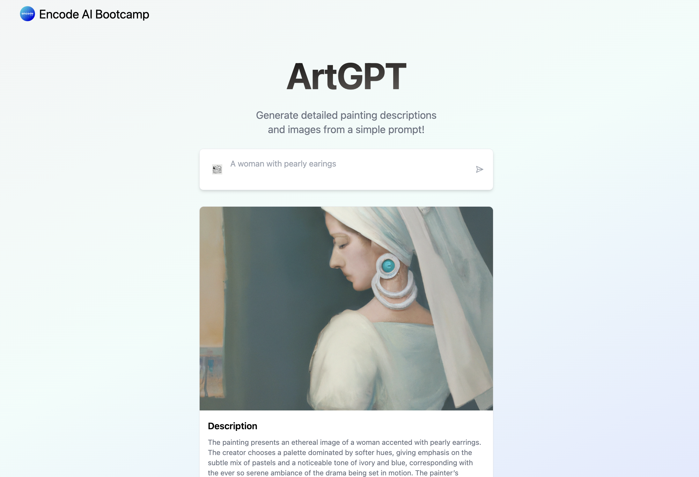

# ArtGPT
**Encode - AI Bootcamp - Week 3 Project**

This project implements a simple Next.JS application that utilises Vercel's AI SDK and OpenAI SDK (Assistant API and Image Generation) to generate painting descriptions based on user input and a pre-selected painting theme. 



## Group Members' IDs
- **76tsNrC**
- **ipJZCWC**
- **s0qmoqC**
- **3nmWtwC**
- **XLiUjNC**

## Get Started

### Cloning the Repository

Clone the repo
```
git clone https://github.com/apogiatzis/encode-ai-artgpt && cd encode-ai-artgpt
```

Install dependencies
```
npm ci
```

In order for the application to work you will have to setup environment variables for OpenAI API. these can be set directly in your terminal or via a `.env` file. See [.env.example](./.env.example) for an example.
```
OPENAI_KEY="sk..." # OpenAI API Key
ASSINSTANT_ID='...' # OpenAI Assistant ID - this has to be created and configured before hand
```

Run NextJS
```
npm run dev 
```
